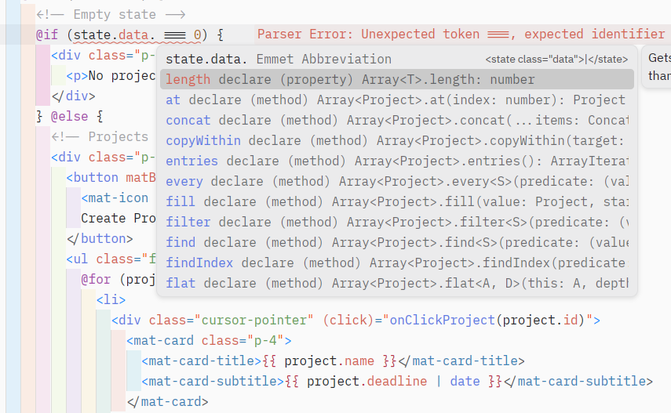
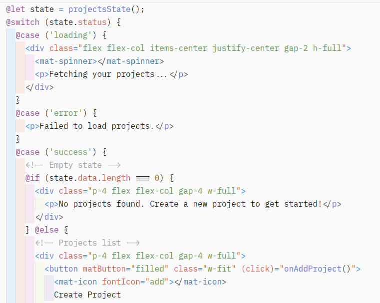

# angular-zed-setup

> A practical guide for configuring Zed for modern Angular development.

## Includes: 
- [Angular Language Service](#important)
- [Format on Save](#zed-settings)
- [Remove Unused Imports](#zed-settings)
- [Recommended extensions](#recommended-extensions)
- [.prettierrc Configuration](#helpful-prettierrc-configuration)
- [Tested Environment](#tested-environment)
- [Assumptions](#assumptions)
- [Troubleshooting](#troubleshooting)
  - [Angular syntax highlighting not working](#angular-syntax-highlighting-not-working)
  - [Organize imports not triggering](#organize-imports-not-triggering)
  - [Prettier not formatting Angular templates](#prettier-not-formatting-angular-templates)
  - [HTML completion and TailwindCSS Intellisense not working](#html-completion-and-tailwindcss-intellisense-not-working)
  - [Project setup outside of `src` directory](#project-setup-outside-of-src-directory)
- [Screenshots](#screenshots)

## Why This Exists

Angular support in Zed currently requires additional configuration to achieve a smooth development workflow.

Documentation and setup information are fragmented across discussions, repositories, and extension pages.

This repository consolidates a working Angular-focused setup with explanations for each configuration choice.

## Prerequisites

- Node.js
- Angular CLI
- Zed

## Recommended Extensions

Install these directly from Zed Extensions

### Important:
- [Angular](https://github.com/nathansbradshaw/zed-angular)

### Optional:
- [SCSS & SASS](https://github.com/bajrangCoder/zed-scss)
- [Emmet](https://github.com/zed-extensions/emmet)
- [Angular Typescript Snippets](https://github.com/hudson-newey/angular-snippets-for-zed)

## Zed Settings

```json
{
  // Zed settings
  
  // Enables prettier formatter.
  "prettier": {
    "allowed": true,
  },
  // Sets the tab size to 2 globally
  "tab_size": 2,
  "languages": {
    "TypeScript": {
      "code_actions_on_format": {
        // Organize and removes unused imports on explicit file save.
        // Applies only to TypeScript files.
        "source.organizeImports": true,
      },
    },
  },
  "autosave": {
    // Saves the file after 1 second of inactivity.
    "after_delay": {
      "milliseconds": 1000,
    },
  },
  // Some exclusions to remove unwanted performance overhead.
  // Note: Choose what to keep or discard based on your preference.
  "file_scan_exclusions": [
    "**/.git",
    "**/node_modules",
    "**/dist",
    "**/.angular",
    "**/coverage",
    "**/.next",
    "**/target",
    "**/coverage",
    "**/.cache",
    "**/.turbo",
    "**/.nx",
    "**/.sass-cache",
  ],
  "file_types": {
    // Treats Angular component templates as Angular files
    // instead of plain HTML for syntax highlighting and tooling.
    "Angular": ["**/src/**/*.html"],
  },
}

```

## Helpful `.prettierrc` configuration

```json
// .prettierrc
// Note: Create this on your root folder
{
  "printWidth": 100,
  "singleQuote": true,
  "overrides": [
    {
      "files": "*.html",
      "options": {
        "parser": "angular"
      }
    }
  ]
}
```

## Tested environment

- Zed v1.1.7
- Angular v21.2.0
- Angular CLI v21.2.7
- Node.js v24.14.0
- Linux (Pop!_OS)

## Assumptions

This guide assumes:
- Modern standalone Angular applications
- Typescript strict mode enabled
- Prettier-based formatting workflow

## Troubleshooting

### Angular syntax highlighting not working

Ensure:
- The Angular extension is installed.
- Files are inside a `src` directory.
- Zed has been restarted after changing `file_types`.

### Organize imports not triggering

Ensure:
- Format on save is enabled.
- The file has been saved.
- The file is recognized as TypeScript.
- Explicitly save the file by either: 
  - hitting the shortcut key `ctrl + s` or 
  - saving the file with `File > Save`

### Prettier not formatting Angular templates

Ensure:
- Prettier is enabled in the settings.
- Prettier is installed in the project.
- `.prettierrc` includes the Angular parser override.

### HTML completion and TailwindCSS Intellisense not working

#### When `.html` files are remapped to the `Angular` language using:

```json
"file_types": {
  "Angular": ["**/src/**/*.html"]
}
```
HTML language features and TailwindCSS IntelliSense may stop working correctly.

At the moment, there is no known configuration that reliably preserves:
- Angular template syntax highlighting
- HTML completion
- TailwindCSS IntelliSense

simultaneously.

#### Workaround:

Temporarily switch the active file language to `HTML`:

- Press `ctrl + k`, then `m`
- Select HTML

This restores:

- HTML completion
- TailwindCSS IntelliSense

However, Angular-specific syntax highlighting may be reduced while the file is in HTML mode.  

### Project setup outside of `src` directory

If Angular templates are located outside the `src` directory
(for example in monorepos, libraries, or Nx workspaces),
update the `file_types` configuration to:

```json
  "file_types": {
    "Angular": ["**/*.html"],
```

## Screenshots

### Angular Language Service and Diagnostics



### Angular Template Syntax Highlighting


